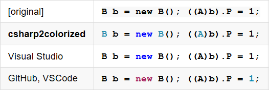

# CSharp2Colorized

This is a command-line utility and a nuget package for colorizing C#. It's goal is to give good colorization even for incomplete code snippets. Here's how it stacks up:



# How to use the command-line utility

You can run the command-line utility in a few ways...

```
echo "Console.WriteLine();" | csharp2colorized -cs
csharp2colorized file1.cs
csharp2colorized *.cs *.vb
csharp2colorized tests.md > results.html
```

In the final example it's given a markdown file, and will replace all fenced codeblocks in vb/csharp with html `<pre>` tags.

I haven't packaged up the command-line utility for download. You have to build it yourself. As well as working on .NET Framework, it also works on "dotnet-cli" for Windows/OSX/linux.

# How to use the library API programmatically

Add a NuGet reference to [csharp2colorized](https://www.nuget.org/packages/csharp2colorized). Programmatically you can call the library API like this:

```csharp
using CSharp2Colorized;
var lines = Colorize.CSharp(code);  // or Colorize.VB(code);
var pre = Colorize.Lines2Html(lines);
Console.WriteLine($"<html><body>{pre}</body></html>");
```

# How it works

It uses Microsoft's Roslyn to parse the code. It parses it as a "script" (.csx/.vbx). Script files are allowed to include expressions, statements and methods at the top level, as well as namespaces and types. That lets it parse fragments pretty well.

Like Visual Studio, it attempts to resolve each identifier to see if it's a type (colorized azure) or a field/property/method/variable (colorized black). Where it differs from VS is that if symbol resolution fails then it falls back on a load of heuristics. These embody expert knowledge of the language syntax. For instance, if you write `typeof(C)` then we can safely colorize `C` as a type even if it hasn't been defined.

# Development notes

If you're contributing to this project, the regression tests are in a file called "tests.md". You should run

```
csharp2colorized tests.md > results.html
```

and then verify that your `results.html` is an exact match for the checked-in `baseline.html`. These tests comprise every code snippet found in the VB and C# language specifications.

